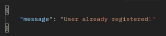

# API RESTFull - HVEX-LOGIN

## Sobre o projeto

Esta é uma API REST construída na fase de Teste Técnico para a vaga de Desenvolvedor(a) Web Back-End Júnior da [HVEX](https://www.hvex.com.br) e tem como principal objetivo o armazenamento de dados de acesso dos usuários no banco de dados MongoDB com gerenciamento por meio desta API.
As funcionalidades da API são:

    1. Criar um novo usuário na rota '/users' com o método POST (CREATE);

    Para criar com sucesso um novo usuário é preciso:

    - Informar um “name” com 4 (quatro) caracteres ou mais;
    - Inserir um “userName” usando letras, números, e os caracteres “.”, “\_”, “-.
    - O "userName" deve ser único.
    - Inserir uma senha;
    - A data será gerada internamente pela aplicação.

    Observação: O primeiro caractere não pode ser um número no campo “userName”.
---

        
Exemplo de dados válidos: 

    
     
        
Resposta: 

    

---

### Exemplos de resposta para dados inválidos

### userName repetido:

### userName inválido:

### Quando o campo "name" não é informado:

### Quando o campo "password" não é informado:

### Quando o campo "userName" não é informado:

    2. Buscar um usuário cadastrado fornecendo o identificador único na rota '/users/:id' com o método GET (READ);
        Atenção: o identificador único é gerado pelo banco de Dados MongoDB.
        exemplo: 6161d59fb94acb000ee3ffc6

### Resultado de uma busca com id válido:

### Resultado de uma busca com id inválido:

    3. Atualizar um cadastro, fornecendo o identificador único na rota '/users/:id' com o método PUT (UPDATE);
        Atenção: para alterar um cadastro com sucesso é necessário observar as restrições impostas no item 1.

        Observação: para exemplos veja o item 1.
        
    4. Excluir um cadastro, fornecendo um identificador único na rota 'users/:id' com o método DELETE;

### Resultado de uma exclusão com id válido:

### Resultado de uma exclusão com id inválido:

---

## Itens obrigatórios:

- [x] O banco de dados deve ser criado utilizando MongoDB.
- [x] A API deve ser desenvolvida utilizando Node.js.
- [x] O projeto deve ser enviado junto de um arquivo README com explicações sobre como
      executar o mesmo.

## Itens opcionais:

- [x] Código bem estruturado.
- [x] README bem escrito.
- [x] Uso de outras tecnologias, além das obrigatórias, para a realização do teste.

## Tecnologias utilizadas

 &nbsp; &nbsp; &nbsp; &nbsp;
 &nbsp; &nbsp; &nbsp; &nbsp;
 &nbsp; &nbsp; &nbsp; &nbsp;

<!-- ## Implantação em produção

 &nbsp; &nbsp; &nbsp; &nbsp; -->

## Como executar o projeto localmente

### Pré-requisitos
    Será necessário ter instalado:
    - NodeJS;
    - MongoDB;
    - npm;

1 - clone o [repositório](https://github.com/renatomak/hvex-api-login.git) do projeto;

      - `git clone https://github.com/renatomak/hvex-api-login.git`.
      - Entre na pasta do repositório que você acabou de clonar:
      - `hvex-api-login`
      - em um terminal digite: npm run dev;

    Para testar a aplicação, execute o script: npm test
